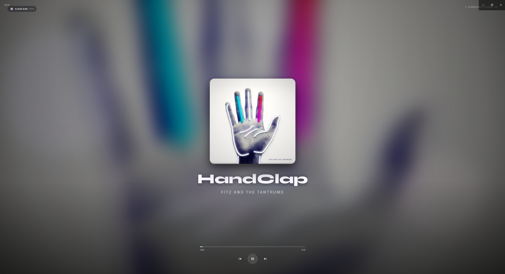

<p align="center">
  
</p>

<br>

<p align="center">
  <b>Turn Spotify's Now Playing view into an immersive fullscreen experience.</b>
</p>

<p align="center">
  Dynamic Scenes · Fullscreen · Playback Controls · Auto-Hide UI
</p>

<p align="center">
  <a href="https://404brainnotfound.at/en/projects/zen-mode/">Write-up</a>
  ·
  <a href="https://404brainnotfound.at">Portfolio</a>
</p>

<br>

<p align="center">
  
</p>

<br>

Zen Mode replaces Spotify's usual interface with a minimalist fullscreen
Now Playing experience built around album artwork, elegant typography and
dynamic animated scenes that adapt to the music currently playing.

Use the playbar button or press <b>F8</b> to enter Zen Mode and leave the rest
of Spotify's interface behind.

## Features

- **Fullscreen overlay** with crossfading cover art, auto-sizing title/artist
  text, a progress bar, and play/pause/skip controls that auto-hide until
  you move the mouse.
- **Scene engine** — detects the vibe of the current track from its title,
  artist and album metadata (Hangul/Kana script, known K-pop/anime artists,
  "OST", lo-fi/chillhop keywords, ...) and renders a matching hand-built
  animated SVG background. Click the badge (top-left) to cycle through
  scenes manually, or let it stay on **Auto**.
- **Keyboard shortcut** — `F8` toggles Zen Mode from anywhere (ignored while
  typing in an input field). A moon-icon button is also added to the
  playbar.
- **No external images** — every scene is inline SVG, so it isn't affected
  by Spotify's Content-Security-Policy blocking external/data-URI images.
- **Reduced-motion aware** — all decorative animation is disabled when the
  OS "prefers reduced motion" setting is on.

## Installation

1. Make sure [Spicetify](https://spicetify.app/docs/getting-started) is
   installed.
2. Copy `zen-mode.js` into your Spicetify `Extensions` folder:

   ```sh
   cp zen-mode.js "$(spicetify -c | xargs dirname)/Extensions/"
   ```

3. Enable and apply it:

   ```sh
   spicetify config extensions zen-mode.js
   spicetify apply
   ```

## Usage

- Click the moon icon in the playbar, or press **F8**, to open/close Zen
  Mode.
- Click anywhere on the empty background to close it (or press **Esc**).
- Click the album cover, or the playback controls at the bottom, to
  play/pause/skip/seek.
- Click the scene badge (top-left) to cycle: `Auto → Anime → K-Pop → Lo-Fi →
  K-Drama → Album Aura → Auto …`

## License

[MIT](LICENSE) © Chrisss666

---

Part of my portfolio at **[404brainnotfound.at](https://404brainnotfound.at)**.
Other projects: [kpop-theme](https://github.com/Chrisss666/kpop-theme) ·
[avatarGenerator](https://github.com/Chrisss666/avatarGenerator) ·
[all of them](https://404brainnotfound.at/en/projects/)
